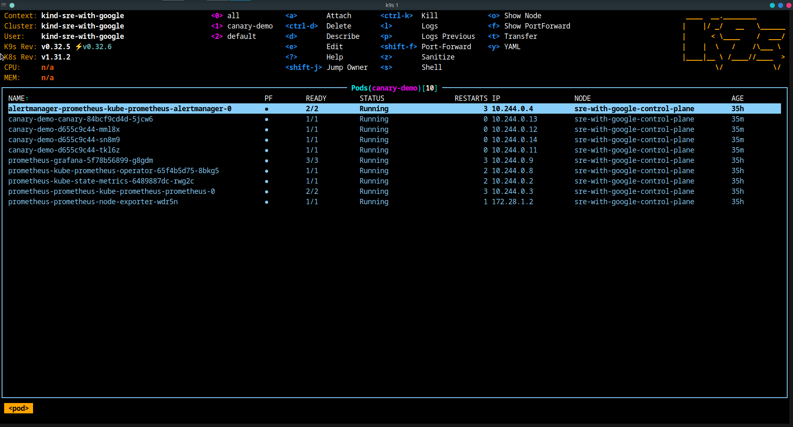
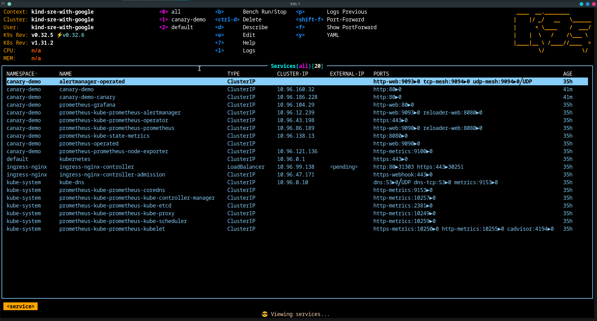
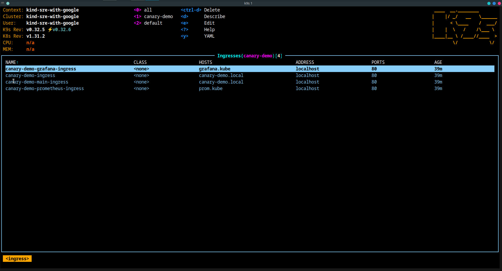
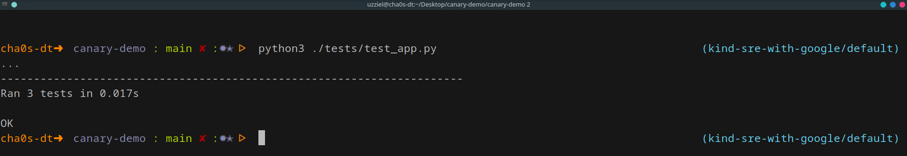

# SRE With Google - Canary-Demo
## Commands
### Create a local cluster with kind (Kubernetes IN Docker)
```
cat <<EOF | kind create cluster --config=-
kind: Cluster
apiVersion: kind.x-k8s.io/v1alpha4
name: sre-with-google
nodes:
- role: control-plane
  extraPortMappings:
  - containerPort: 80
    hostPort: 80
    protocol: TCP
  - containerPort: 443
    hostPort: 443
    protocol: TCP
EOF
```

### install nginx-ingress
```
kubectl apply -f https://kind.sigs.k8s.io/examples/ingress/deploy-ingress-nginx.yaml
```
### add records to /etc/hosts
```
sudo sed -i '/127.0.0.1/s/$/ canary-demo.local grafana.kube prom.kube/' /etc/hosts
```

### create canary-demo namespace
```
kubectl create ns canary-demo
```

### install prometheus stack via helm
```
helm install prometheus prometheus-community/kube-prometheus-stack -n canary-demo
```

## Screenshots
### Pods 
### Services 
### Ingresses 
### Tests output 